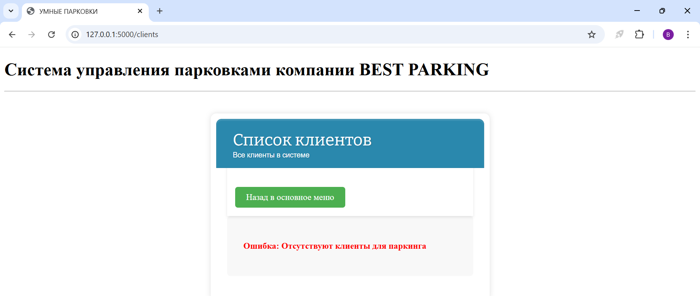
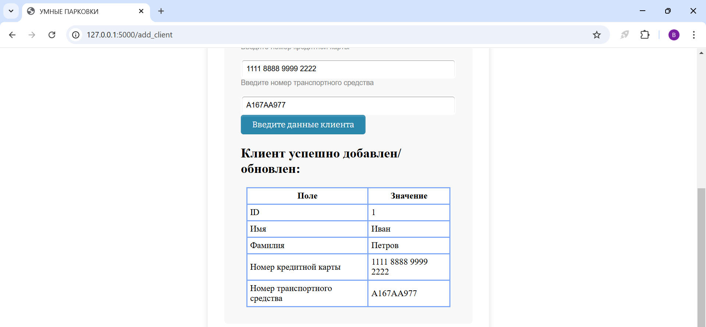
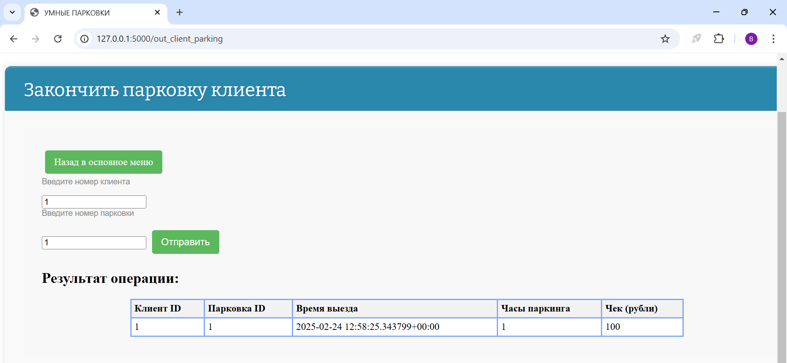

# ***УМНЫЕ ПАРКОВКИ***
   -Это учебное приложение к 29 модулю python advanced skillbox

## *Структура и схема*

### Структура

    best_parking/
    |--- .env
    |--- Docker
    |--- docker-compose.sql
    |--- .gitignore
    |--- __init__.py
    |--- init.sql
    |--- requirement.txt
    |--- app/
         |--- tests/
         |    |--- __init__.py
         |    |--- файлы с тестами
         |    |--- conftests.py
         |--- factories/
         |    |--- __init__.py
         |    |--- файлы для фабрик
         |--- templates/
         |    |--- шаблоны html
         |--- static/
         |    |--- файлы стилей static.css и другие
         |--- services/
         |    |--- __init__.py
         |    |--- файлы обработки маршрутных функций для связи с моделями
         |--- models.py
         |--- database.py
         |--- utils.py
         |--- log.py
         |--- pytest.ini
         |--- schema.py
         |--- validate.py
         |--- flask_main.py
         |--- wsgi.py

### Описание с точки зрения REST API MVC

Model (Модель)
models.py: Содержит определения моделей данных, которые используются в приложении.

database.py: Обеспечивает взаимодействие с базой данных.

schema.py: Определяет схему данных для сериализации полученных объектов.

validate.py: Содержит функции для валидации входных данных.

View (Представление)
templates/: Содержит шаблоны HTML для отображения данных пользователю.

static/: Хранит статические файлы (стили, скрипты, изображения), которые используются в шаблонах.

Controller (Контроллер)
services/: Содержит логику обработки запросов и взаимодействия с моделями. Здесь реализуются маршрутные функции, которые обрабатывают HTTP-запросы и возвращают ответы.

flask_main.py: Основной файл приложения Flask, в котором определяются маршруты и запускается приложение.

wsgi.py: Используется для запуска приложения в среде WSGI.

Дополнительные компоненты
tests/: Содержит тесты для приложения.

factories/: Используется для создания фабрик, которые помогают генерировать тестовые данные.

log.py: Обеспечивает логирование событий в приложении.
    
    +---------------+
    |  Client     |
    +---------------+
             |
             | HTTP Request
             v
    +---------------+
    |  WSGI Server |
    |  (Gunicorn)  |
    |              |
    +---------------+
             |
             | Запуск приложения
             v
    +---------------+
    |  wsgi.py     |
    |  (Создание   |
    |   приложения) |
    +---------------+
             |
             | Обработка запроса
             v
    +---------------+
    |  Flask App   |
    |  (Controller) |
    +---------------+
             |
             | Обработка запроса
             v
    +---------------+
    |  Services    |
    |  (Controller) |
    +---------------+
             |
             | Взаимодействие с моделями
             v
    +---------------+
    |  Models      |
    |  (Model)     |
    +---------------+
             |
             | Доступ к данным
             v
    +---------------+
    |  Database    |
    |  (Model)     |
    +---------------+

В этой схеме клиент отправляет HTTP-запросы в приложение Flask, которое обрабатывает их 
с помощью контроллера (services/). Контроллер взаимодействует с моделями (models.py, database.py), 
которые обеспечивают доступ к данным. Результаты обработки затем возвращаются клиенту через шаблоны 
(templates/) и статические файлы (static/).

## *Работа с приложением*

### Подготовка

После скачивания приложения создать в корне проекта виртуальное окружение:
bash     python3 -m venv .myenv
bash     source .myenv/bin/activate
создать файл .env c указанием:
         
         DB_USER=ваш логин
         DB_PASSWORD=ваш пароль
         SECRET_KEY=ваш ключ

### Запуск приложения в фоновом режиме

bash     docker compose up --build -d
Результат:

bash     docker ps
Результат:

bash     docker compose logs web
логи web будут писаться

bash      docker compose logs db
логи db будут писаться

#### Установлены зависимости
flask==3.1.0
sqlalchemy==2.0.38
flask-sqlalchemy==3.1.1
gunicorn==23.0.0
psycopg2-binary==2.9.10
python-dotenv==1.0.1
loguru==0.7.3
requests==2.32.3
pytest==8.3.4
factory-boy==3.3.3
nano==0.10.0
marshmallow-sqlalchemy==1.4.1
marshmallow==3.26.1
flask-wtf==1.2.2
blinker==1.9.0

flake8==7.1.2
isort==6.0.0
ruff==0.9.7
mypy==1.15.0
pylint==3.3.4

#### База данных

PostgreSQL.

### Тестирование
Это учебное задание, поэтому тестирование проводится перед созданием базы данных, и не предназначено, 
для использования после заполнения таблиц, так как убивает таблицы в конце теста и закрывает сессию.

bash   docker compose up --build -d

bash   docker exec -it  best_parking-web-1 bash 

root@6d49bff8a48b:/app# pytest

root@6d49bff8a48b:/app# pytest -m parking

root@6d49bff8a48b:/app# pytest -m fake

root@6d49bff8a48b:/app# pytest -m html

bash docker compose down

### Работа с приложением и с базой данных best_parking_db

bash docker compose up --build -d

Таблицы создаются сразу, при первом посещении

Пока таблицы пустые

Обязательные поля

Ввели

Поля парковки

Добавлена парковка

Список парковок

Паркуем

Пытаемся выпустить

Ищем, проверяем причину

Обновили

Ошиблись - нет парковки

Не там стоит

Успешно выехал 

Нет клиента

Заняли свободные места

Осталось 0 мест на первой парковке

Не пустили

Освободили место

Не того хотели пустить

Пустили

Информация паркингов

## Права принадлежат народу. Всем удачи!

